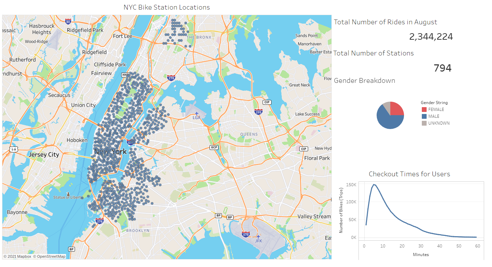
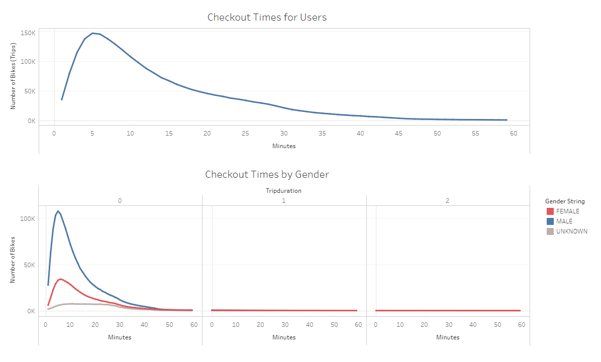
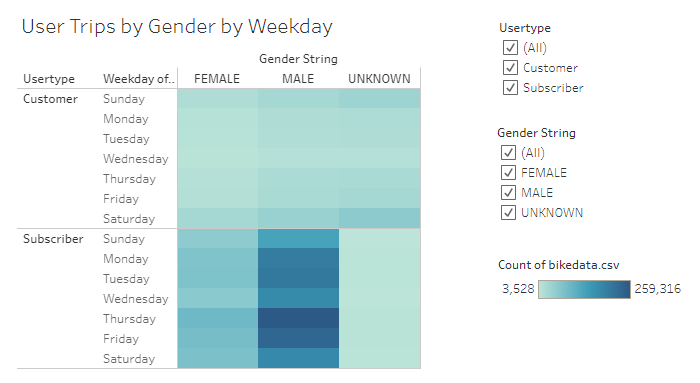
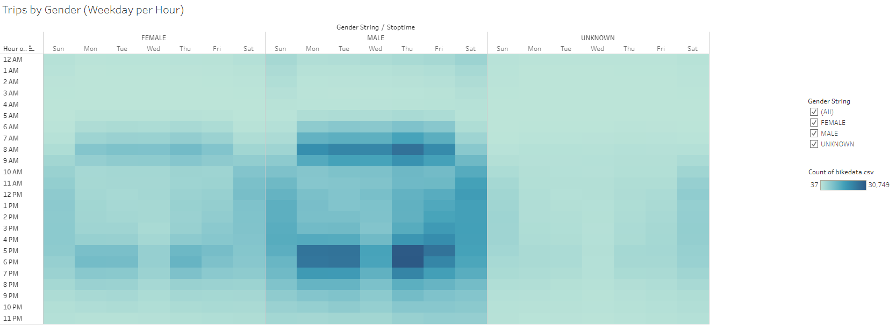
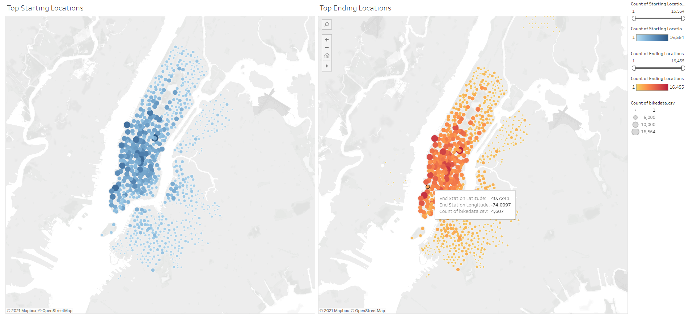

# Overview 
The purpose of this analysis is to provide insight on NYC's Citibike data by exploring the data of the bike-share service for the month of August 2019. Utilizing Tableau Dashboards to tell a story with the Citibike data, we can better understand the business and its customers with interactive charts/graphs, to ultimately come to a decision on whether this business plan could be implemented in other cities.

Bike trip history data is available from the Citibike system data site: https://www.citibikenyc.com/system-data. For the purposes of this analysis, bike sharing for the month of August was used [201908-citibike-tripdata.csv.zip](https://s3.amazonaws.com/tripdata/JC-201908-citibike-tripdata.csv.zip). 

# Results

### Please view the Tableau Public link [here](https://public.tableau.com/profile/andrew.sukmawan#!/vizhome/NYCCitibikeDashboard-August2019/NYCCitibikeAugust "link to dashboard")

#
## Overview
Over 2 million rides have been recorded for just in the month of August, and this is done with 794 bike stations available cross New York City. With this data, we are also able to determine that most riders in the month of August were Male. Also, the majority of rides regardless of gender, usually lasts from 3 - 9 minutes long.

### Figure 1 - NYC Citibike Overview for August
</img>

Looking further into the trip durations, the duration with the highest frequency per trip lasts 5 minutes.
## Checkout times
### Figure 2 - Checkout Times
</img>

Breaking this out by Gender, females tend to use the bikes for longer by one minute (highest frequency being 6 minutes), while males take 5 minutes. As for those trips that don't have a gender specified, we can take a look further at the next figure.
## User Trip statistics
### Figure 3 - User Trips by Gender by Weekday
</img>

There are two types of users defined by Citibike's policy: https://www.citibikenyc.com/system-data:

- Customers are defined as having purchased a 24-hour pass or 3-day pass. 
- Subscribers are those that have paid for the annual membership. 

Both male and female subscribers tend to utilize the bike sharing program heavily during the weekdays, while customers are slightly more inclined to use the service during the weekends.

### Figure 4 - User Trips by Weekday per Hour
</img>

Digging deeper into the hourly frequency of these trips, we can see that the majority of rentals take place around 7am-9am, and 5pm-7pm. While the weekends are more distributed across daytime hours

### Figure 5 - Trips by Gender (Weekday per Hour)
</img>

Separating the previous chart by gender, both male and females riders look to be renting bikes during morning and evening rush hours during the week. And as the chart before, weekend rentals are more distributed throughout the daylight hours. 

Data for those that don't have a gender specified, most riders that fall under this category are more frequent during the weekends.

### Figure 6 - Top Starting and Ending Locations
</img>

Many of the top starting and ending locations are within the city. Since duration of most trips span only a few minutes, the most frequently used bike stations would be within the core of the city.

# Conclusions

In conclusion, the majority of users of the bike-sharing program are those that use the bikes for short periods - 5 minutes mostly - and are most likely using them primarily for their morning and evening commute within the city. 

These riders are mostly registered subscribers that are regular users, which mainly use the service monday to friday to get to and from work in the city. This can be deduced by observing [Figure 4](#Figure-4---User-Trips-by-Weekday-per-Hour) as rentals taken out during the weekdays are mainly in the mornings (7am-9am) and evenings (5pm-7pm). Trends between male and female follow one another, with higher volume for males. 

Referring back to [Figure 2](#-Figure-2---Checkout-Times), the checkout times for unknown genders are more likely due to the higher number of non-subscribed short-term customers using the service during the weekends and thus are using the bikes for longer on average. Checkout times for these non-subscribers are using the bikes for much longer as these type of users are most likely tourists or those that are exploring the city as opposed to only just getting from one place to another. 

Since the majority of the duration of a ride only spans a few minutes, it would be a likely guess that the majority of the rentals are taking place inside the main core of the city. Looking at the top starting and ending locations [Figure 6](#-Figure-6---Top-Starting-and-Ending-Locations), this falls in line with this conclusions as most trips spanning a few minutes will not likely reach beyond the outskirts of the city. 

This could be primarily due to the construction of the bikes themselves. Meant for durability and not comfort or speed, users looking to travel into the city from outside of it are less likely to use the service, as they would search out other alternatives of transportation, or bikes that are meant for long-distance travel.

### Additional Visualizations suggested

Further visualizations to explore, could be the mapping of the various potential routes or paths riders are taking, as well as 

1. Paths between origins and destinations

Since we have co-ordinate data of our starting and endpoints for each ride, as well as the duration of the trip we can attempt to map out paths between those two points. If for the very least, visualize the distance between two points to see how far some of these bikes can travel.

With this data, we can create a top 10 most travelled paths to determine high volume areas. This can be a further benefit to see if there are any additional bike stations required along those paths.

2. Age vs User-type

By exploring the age of bike-share subscribers vs one-day/3-day customers, we can potentially uncover opportunities to reach out those age groups by providing competitive pricing or discounted annual plans to gain more subscribers in a particular age group.

